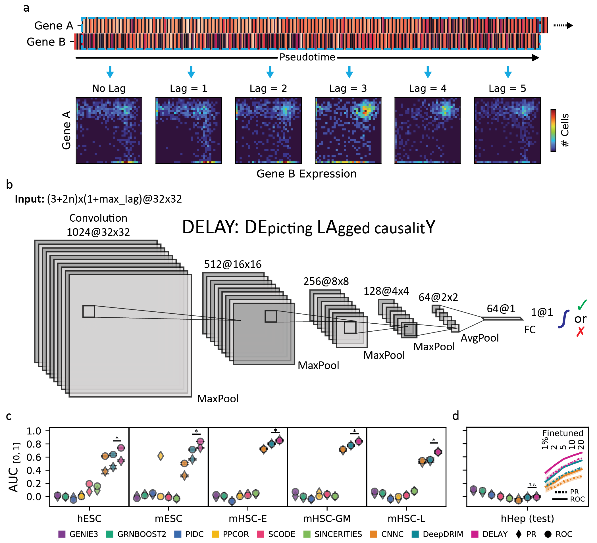
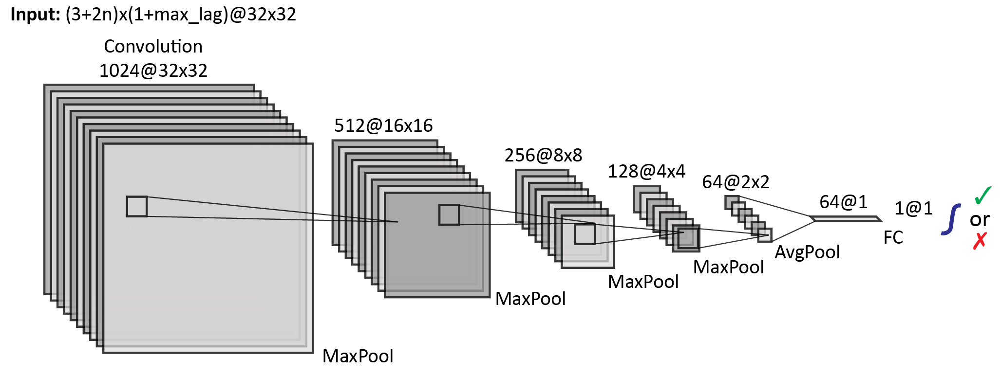
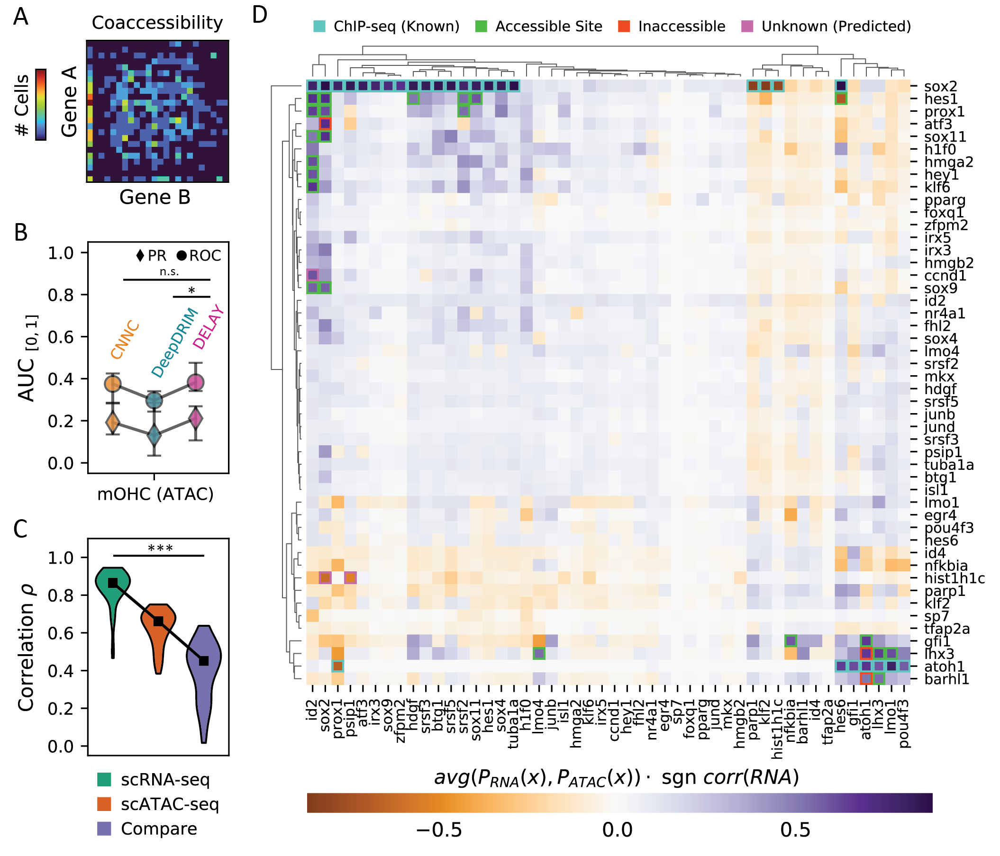

# DELAY: DEpicting LAgged causalitY Across Single-Cell Trajectories for Accurate Gene Regulatory Inference



## Quick Setup

Navigate to the location where you want to clone the repository and run:

```
$ git clone https://github.com/calebclayreagor/DELAY.git
```

## Example Usage

### Preparing A New Single-Cell Dataset For Use (Step 0)

```
python Network.py --load_datasets False \
                  --datasets_dir /full/path/to/dsets/ \
                  --data_type scrna-seq \
                  --batch_size 512 \
                  --neighbors 2 \
                  --maxlag 5 \
                  --nbins_img 32
```

### Finetuning Trained Models On A New Dataset (Step 1)

```
python Network.py --do_training False \
                  --do_predict True \
                  --do_finetune True \
                  --datasets_dir /full/path/to/dsets/ \
                  --output_dir relative/path/for/logs \
                  --model_dir /full/path/to/model.ckpt \
                  --model_cfg 1024,M,512,M,256,M,128,M,64 \
                  --model_type inverted-vgg \
                  --train_split 1. \
                  --lr_init .5 \
                  --max_epochs 100
```

### Using Finetuned Models To Make Predictions (Step 2)

```
python Network.py --do_training False \
                  --do_predict True \
                  --datasets_dir /full/path/to/dsets/ \
                  --output_dir relative/path/for/logs \
                  --model_dir /full/path/to/model.ckpt \
                  --model_cfg 1024,M,512,M,256,M,128,M,64 \
                  --model_type inverted-vgg
```

## Required Inputs

### ``ExpressionData.csv`` or ``AccessibilityData.csv``

``genes x cells`` matrix of normalized expression or accessibility values for scRNA-seq or scATAC-seq data, respectively

### ``PseudoTime.csv``

``cells x trajectories`` matrix of inferred pseudotime values, with the option to provide independent values for multiple lineages using different columns with headings ``PseudoTime1``, ``PseudoTime2``, etc.

## Network Architecture



## More Examples

### Training New Models From Scratch

```
python Network.py --global_seed 1010 \
                  --datasets_dir /full/path/to/dsets/ \
                  --output_dir relative/path/for/logs \
                  --model_cfg 32,32,M,64,64,M,128,128 \
                  --model_type vgg
                  --train_split .7 \
                  --lr_init .5 \
                  --max_epochs 100    
```

### Testing/Finetuning On Known Datasets

```
python Network.py --do_training False \
                  --do_testing True \
                  --do_finetune True \
                  --global_seed 1010 \
                  --datasets_dir /full/path/to/dsets/ \
                  --output_dir relative/path/for/logs \
                  --model_dir /full/path/to/model.ckpt \
                  --model_cfg 32,32,M,64,64,M,128,128 \
                  --model_type vgg
                  --train_split .7 \
                  --lr_init .5 \
                  --max_epochs 100            
```

## Read the Preprint


