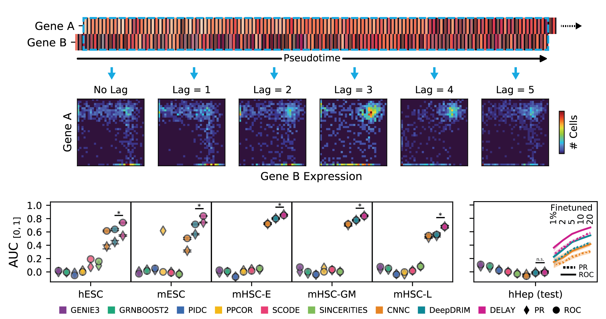

# DELAY: DEpicting LAgged causalitY across single-cell trajectories for accurate gene-regulatory inference



# Quick Setup

1. Follow these instructions to install the latest version of PyTorch with CUDA support: https://pytorch.org

   - Please note, DELAY currently requires CUDA-capable GPUs for training and prediction

2. Confirm that two additional dependencies ``pytorch-lightning`` and ``pandas`` have been satisfied

3. Navigate to the location where you want to clone the repository and run: 

```
$ git clone https://github.com/calebclayreagor/DELAY.git
```

# Two Steps to Infer Gene-Regulatory Networks

### 1. Fine-tune DELAY on datasets with partially-known ground-truth interactions, e.g. from ChIP-seq experiments:

```
python RunDELAY.py [datadir] [outdir] -p -m [/.../trainedModel-1.ckpt] -ft -k [val_fold] -e 1000
```

- Use TensorBoard to monitor training by runnning ``tensorboard --logdir RESULTS`` from the main directory
- By default, DELAY will save the best model weights to a checkpoint file in ``outdir``

### 2. Predict gene regulation across all TF-target gene pairs using the fine-tuned model:

```
python RunDELAY.py [datadir] [outdir] -p -m [/.../finetunedModel.ckpt]
```

- DELAY will save the predicted probabilities as a ``tfs x genes`` matrix in ``outdir/regPredictions.csv``

# Input Files

One or more datasets can be specified as sub-directories in ``datadir`` containing the following input files:

### 1. ``NormalizedData.csv`` (required)

- A labeled ``genes x cells`` matrix of normalized expression (scRNA-seq) or accessibility (scATAC-seq) values for the input dataset

### 2. ``PseudoTime.csv`` (required)

- A labeled ``cells x trajectories`` matrix of inferred pseudotime values for one or more trajectories (e.g. ``PseudoTime1``, ``PseudoTime2``, etc.) found in the input dataset (each used separately)

### 3. ``refNetwork.csv`` (required)

- A two-column table of transcription factors (``Gene1``) and targets (``Gene2``) in the fully- or partially-known ground truth regulatory network (e.g. from cell-type specific ChIP-seq data)

### 4. ``TranscriptionFactors.csv`` (optional)

- A one-column table of known transcription factors (``Gene1``) in the input dataset (required for finetuning and prediction with partially-known ground truths)

## More Examples

### Train a new model with the specified configuration (e.g. VGG-6) on datasets with fully-known ground-truth interactions

```
python RunDELAY.py [datadir] [outdir] --model_type vgg -cfg 32 32 M 64 64 M 128 128 M --train -k [valfold]
```

## Help


## Downloads

The datasets used in this study are available here: https://doi.org/10.5281/zenodo.5711739

Saved model weights for DELAY are available here: https://doi.org/10.5281/zenodo.5711792

Experiment logs from the study are available here: https://tensorboard.dev/experiment/RBVBetLMRDiEvO7sBl452A

### Read the preprint: https://www.biorxiv.org/content/10.1101/2022.04.25.489377v2
