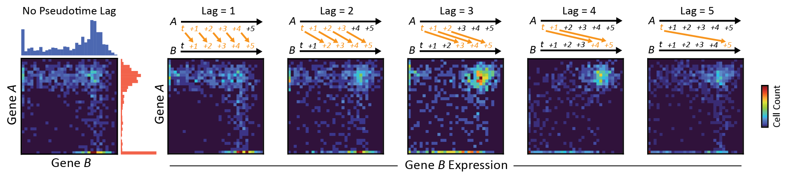

# DELAY: DEpicting LAgged causalitY Across Single-Cell Trajectories for Accurate Gene Regulatory Inference 



## Example Usage

### Preparing A Single-Cell Dataset (Step 0)

```
python Network.py --load_datasets False \
                  --datasets_dir /path/to/datasets/files/ \
                  --data_type scrna-seq \
                  --batch_size 512 \
                  --neighbors 2 \
                  --maxlag 5 \
                  --nbins_img 32
```

### Finetuning A Trained Model On A New Dataset (Step 1)

```
python Network.py --do_training False \
                  --do_predict True \
                  --do_finetune True \
                  --datasets_dir /path/to/datasets/files/ \
                  --output_dir /path/to/logged/outputs/ \
                  --model_dir /path/to/trained/model.ckpt \
                  --model_cfg 1024,M,512,M,256,M,128,M,64 \
                  --model_type inverted-vgg \
                  --train_split 1. \
                  --lr_init .5 \
                  --max_epochs 100
```

### Using A Finetuned Model To Make Predictions (Step 2)

```
python Network.py --do_training False \
                  --do_predict True \
                  --datasets_dir /path/to/datasets/files/ \
                  --output_dir /path/to/logged/outputs/ \
                  --model_dir /path/to/trained/model.ckpt \
                  --model_cfg 1024,M,512,M,256,M,128,M,64 \
                  --model_type inverted-vgg
```
